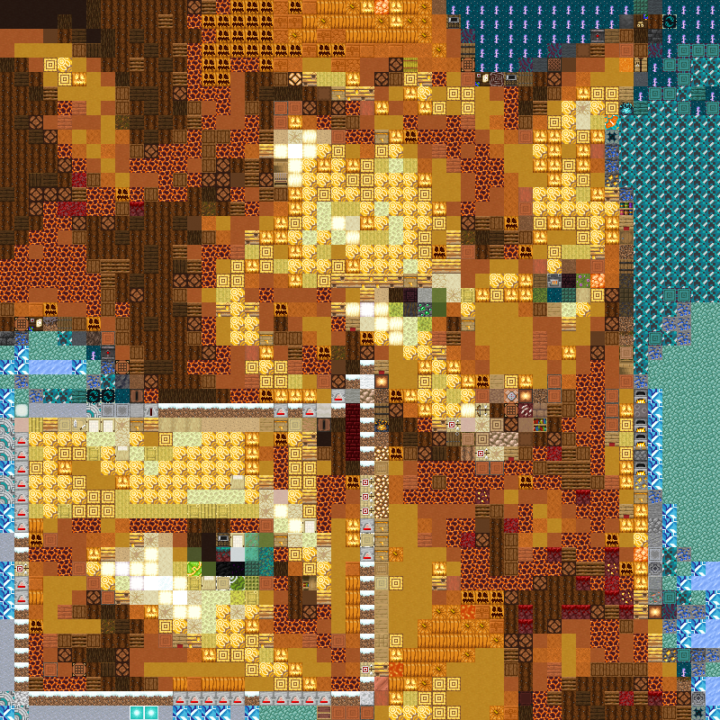
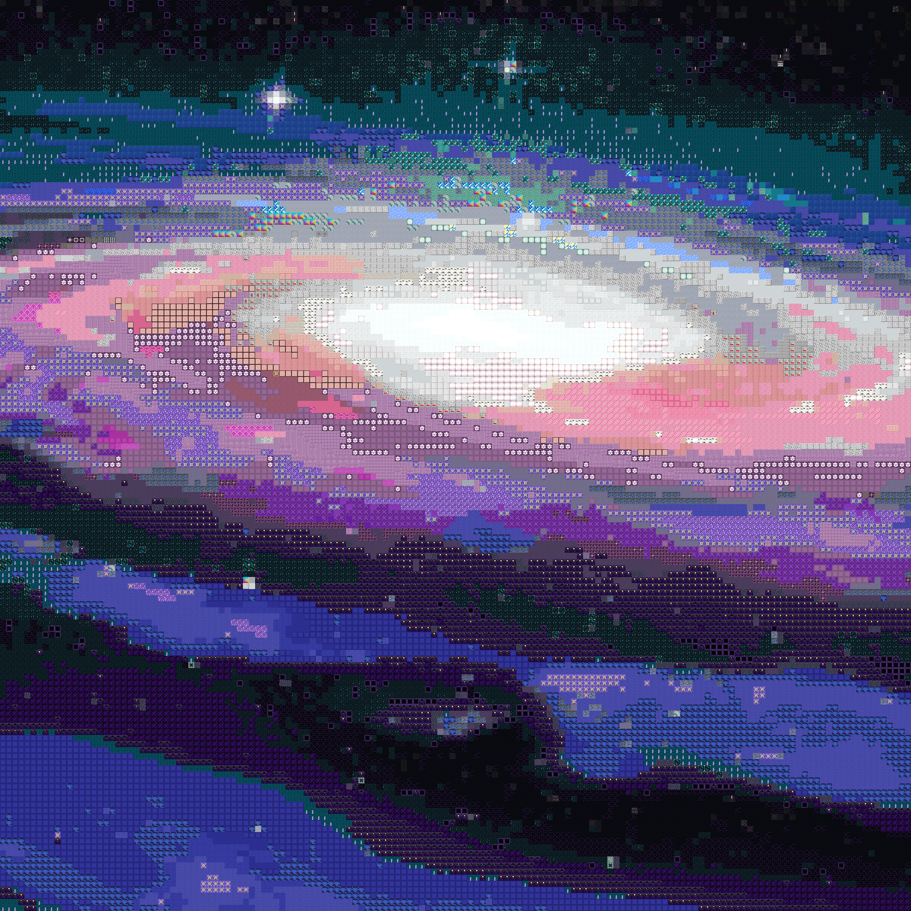

# Minecraft-Pixel-Art
takes a pixel art image and outputs an array of minecraft blocks in order to convert pixel art pieces into buildable minecraft art!

converter.py is used to take an input image (of any type that PIL can read and convert to an RGBA png image) and convert it to a custom sized approximation created with minecraft blocks.
An image is output with the face of each block used to generate the pixel art, and you can choose between any block type (including creative and command-only accessible blocks) or only survival accessible blocks.
This also works with *any* texture pack, simply replace the 'blocks' folder with your block palette and an image will be generated from the files provided.

The approximation can be generated by determining the average RGBA representation of the region each block will represent, and this can be matched against either the average (mean) or median colour of each block provided in the 'blocks' folder. Typically, the average colour provides a much better output.

## Examples
### Small Sample

### Medium Sample

### Large Sample
also works with jpg inputs

