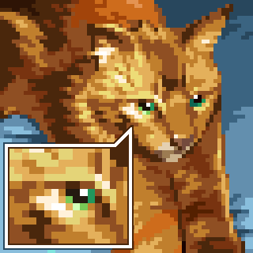

# Minecraft-Pixel-Art
takes a pixel art image and outputs an array of minecraft blocks in order to convert pixel art pieces into buildable minecraft art!

## Examples
### Small Sample

### Medium Sample

### Large Sample

